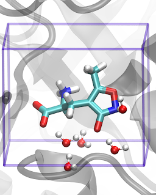
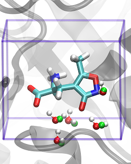

# Exercise 2 - GCMC Calculations for Water Binding

## Contents

1. Overview
2. Setup
3. Analysis
4. Binding free energy
5. Binding free energy - Analysis

## Overview

This section will give you a basic introduction to grand canonical Monte Carlo (GCMC), a powerful method that can overcome physical barriers that hinder sampling. Here, we will use GCMC to predict the locations of water molecules in a protein-ligand complex. In contrast to standard Monte Carlo, GCMC has additional "insertion" and "deletion" moves that are available to a chosen molecule, in this case water. By allowing water molecules to be created and annihilated in a given region, water can be efficiently sampled, even in cavities that are occluded from bulk water. 

The probablity to accept or reject an insertion or deletion move is controlled by the chemical potential, and - in a manner directly analogous to energy fluctuations at a constant temperature - GCMC allows for the number of particles to fluctuate at a constant chemical potential. In GCMC, the chemical potential is a user defined parameter, and must be set a priori. Choosing a suitable chemical potential will be discussed during the setup. This is so that you can get a flavour as to what GCMC is all about, and the implementation in ProtoMS.

## Setup

We will continue to use our previous example of the ionotropic glutamate receptor GluR2 bound to the agonist AMPA. This system is a good example of where water molecules mediate interactions between the protein and ligand. The PDB code for the original coordinates is 1FTM.

This exercise uses the same input files as the previous one and can in fact be carried out from the same directory without interfering. As we're interested in the water molecules around the ligand, we'll use the ProtoMS python scripts to automatically construct a GCMC box around the ligand. 

> python2.7 $PROTOMSHOME/protoms.py -p protein.pdb -l amq.pdb --charge -1 -s gcmc

This is very similar to the setup line from the previous exercise except we've requested a gcmc simulation. If you are also working in the same directory as last time you'll notice that ProtoMS recognised that a amq.tem had already been created and did not bother to reparameterise the ligand. You'll also notice that in addition to the files for the sampling simulation we have three new files - gcmc\_box.pdb, gcmc\_wat.pdb and water\_clr.pdb. We also have run\_gcmc.cmd instead of run\_bnd.cmd. gcmc\_box.pdb is provided for convenience to visualise the volume where water molecules will be inserted and deleted, and gcmc\_wat.pdb contains the water molecules that are allowed to be inserted and deleted.

The gcmc box has been automatically created so that its edges are no less than 2 Angstroms away from the ligand. However, it's really important we get the box right, so let's check to see if it looks okay. Visualise the protein-ligand complex along with the gcmc region. This is not supported by viewMolecules in a Jupyter notebook so you'll need to copy the relevant files to your local machine and view them there, for instance with pymol:

> pymol protein\_scoop.pdb amq.pdb water\_clr.pdb gcmc\_box.pdb

or vmd:

> vmd -m protein\_scoop.pdb amq.pdb water\_clr.pdb gcmc\_wat.pdb gcmc\_box.pdb

Find the atom OE1. This ketone has the ability to hydrogen bond with two water molecules, yet it seems a little too close to the box edge. 

We can create a larger box by using the one of the programs in the tools directory of the ProtoMS folder. First, have a look at the "help" for the (well named) function "make\_gcmcbox.py"

> python2.7 $PROTOMSHOME/tools/make\_gcmcbox.py -h

Note that we can manually input the box centre and edge lengths, but as all we want to do it is make a larger box around the ligand (3 Angstroms ought to do it), we'll type 

> python2.7 $PROTOMSHOME/tools/make\_gcmcbox.py -s amq.pdb -p 2.5

Visualise the new box and convince yourself that this volume will encompass any potential water molecules that can hydrogen bond with the ligand. Bear in mind that insertion moves are attempted throughout the gcmc region and so the more occluded volume it contains, the lower your insertion efficiency will be. The water_clr.pdb has had any water molecules that were previously the inside the gcmc region  deleted for reasons discussed below. 
 
Note the output of this script:

> Volume of GCMC box: 1068.81  
> Bequil: -6.9

This is telling us the volume of the GCMC box when using a padding of 3 Angstroms around the ligand. The second value is Bequil. We will need to tell ProtoMS what chemical potential we want to simulate at, although for technical reasons, we actually simulate with something called the "Adam's" parameter (confusingly shortened as just B) instead of the chemical potential itself. Don't let this be a source of confusion, as the two are related by an additive constant. The correct chemical potential can be calculated using the equation below.

> Bequil = \beta\mu' + ln(Vbox/Vstandard)

Vstandard is 30.0 Angstrom3, the volume of a water molecule under standard conditions. \beta is thermodynamic beta and \mu' is the equilibrium chemical potential of water, calculated to be -6.2 kcal.mol-1 by ProtoMS. 

The B value which gives us the correct water occupancy for equilibrium with bulk water in a GCMC simulation of a box of this size is -6.9.

We'll use protoms.py to set up our system again, but this time using the new box as an input. To save time, we'll re-use the protein scoop, water droplet, and ligand parameter files that were created the first time protoms.py was run.

> python2.7 $PROTOMSHOME/protoms.py -s gcmc -l amq.pdb -w water.pdb -sc protein\_scoop.pdb --gcmcbox gcmc\_box.pdb --adams -6.9 

The file that will instruct ProtoMS how to perform Monte Carlo is called run_bnd.cmd. Open up this command file and have a look at the parameters that are specific to GCMC. You should see something like

> gcmc 0  
> parfile $PROTOMSHOME/data/gcmc\_tip4p.tem  
> grand1 gcmc\_wat.pdb  
> potential -6.900  
> originx 71.75  
> originy 21.45  
> originz 35.98  
> x 8.88  
> y 10.14  
> z 11.87 

The first line tells ProtoMS that all of the waters in gcmc\_wat.pdb will start in the "off" state, i.e. 0. The last six lines specify the volume where GCMC will be performed. The GCMC waters in gcmc\_wat.pdb will not be allowed to translate outside of this box, and solvent water molecules in water\_clr.pdb will be excluded from this region. What do you think the other commands mean? 

Also in the run_gcmc.cmd are the simulation 'chunks', which describe the equilibration and production simulations that will be performed. Here you can see that we have two equilibration steps, firstly with only grand-canonical moves being performed; that is grand-canonical water insertion, deletion and translation. This is followed by an equilibration stage with protein, solvent and solute sampling as well as the GC moves. Finally there are 40 million production moves.

> chunk equilibrate 5000000 solvent=0 protein=0 solute=0 insertion=333 deletion=333 gcsolute=333
> chunk equilibrate 5000000 solvent=344 protein=149 solute=7 insertion=167 deletion=167 gcsolute=167
> chunk simulate 40000000 solvent=344 protein=149 solute=7 insertion=167 deletion=167 gcsolute=167

As the command file "run\_gcmc.cmd" contains all the information necessary to run GCMC, execute ProtoMS by typing 

> $PROTOMSHOME/protoms3 run\_gcmc.cmd

Either run it on your local machine (e.g. if you have multiple cores), or have a go at submitting the job to a queue by modifying the script you used in Exercise 2. This will take around 4 hours to complete, so only submit if you have enough time.

## Analysis

This above command will have created the directory out\_gcmc1. As before, an example output from a completed simulation run can be found in the example\_outputs folder. You can extract out\_gcmc1 from the archive with the command:

> tar xf out_gcmc1.tar.gz

You can visualise all.pdb from the output directory to see waters inserting and deleting in the gcmc region. If your choice of molecular viewer (e.g. vmd) doesn't get on with trajectories with variable numbers of atoms then try using make\_gcmc\_traj.py in the $PROTOMSHOME/tools folder.

First, let's have a look at how well equilibrated the number of inserted water molecules is. We'll use calc\_series.py, which has an interactive interface. To use it in such a manner, type 

> python2.7 $PROTOMSHOME/tools/calc_series.py -f out\_gcmc1/results -s solventson

This will plot the number of inserted waters with simulation time, and estimate when the number has equilibrated. For our results, the simulation consistently shows 5 waters in the GCMC box. If the data is noisier there are other options too, such as a moving average. For instance, to average over a window of 50 frames, type

> python2.7 $PROTOMSHOME/tools/calc_series.py -f out\_gcmc1/results -s solventson --moving 50

Using either calc\_clusters.py or calc\_density.py, we can have a look at the hydration structure predicted by GCMC. 

> python2.7 $PROTOMSHOME/tools/calc_clusters.py -f out\_gcmc1/all.pdb -m WA1 -o watclusts.pdb

Visualise the system along with watclusts.pdb. You should end up with positions like this: 

This shows us that the number of waters expected in the protein-ligand complex is five, with the waters in the positions shown above. This is because we performed the simulation at Bequil. 

We can compare this to the crystallographic protein structure. Download the pdb structure 1FTM from [www.rcsb.org](www.rcsb.org) and view the crystal structure at the same time as the simulation results:

The crystallographic oxygen atoms of the water molecules are shown in bright green. You can see that the 5 GCMC waters overlap with the 5 waters seen within the same region of the crystal structure. GCMC has gotten both the number of waters and the location of them correct. 

## Binding free energy

Understanding the binding free energy of water molecules and networks can be useful for drug design. To calculate the binding free energy of the water network another set of simulations is required. In a new directory, such as not to overwrite the previous results, copy the input files over. As we have set up the system before we can use the same files for the gcmc box, gcmc waters and bulk solvent, however if they were missing they would be generated by the system set up automatically. 

> mkdir bindingFE
> cp protein\_scoop.pdb amq.pdb amq.tem gcmc\_box.pdb gcmc\_wat.pdb water\_clr.pdb bindingFE
> cd bindingFE

The simulation file can be set up using the command below. The command is similar to that used in the previous section, however now we are using the --adamsrange flag instead of the --adams one. This means that B values will be simulated between -27.9 and -4.9. It is important that the range of B values covers the calculated Bequil. The 16 indicates that we are simulating 16 B values equally spaced between the range. 16 has been chosen as it is the number of processors per node that are available on our computing resource, however this can easily be changed to suit your environment.

> python2.7 $PROTOMSHOME/protoms.py -s gcmc -l amq.pdb -w water.pdb -sc protein\_scoop.pdb --gcmcbox gcmc\_box.pdb --adamsrange -27.9 -4.9 16 

Check what new files have been created. Before we were using the Bequil value to look at the equilibrium water network, however to calculate the binding free energies of the water molecules, we need to compare this to the same system with no waters in. Simulating at lower B value will steadily reduce the number of waters in the system. As we are now simulating 16 B values, we will need 16 processors, which can be run using:

> mpirun -np 16 $PROTOMSHOME/protoms3 run_gcmc.cmd

The simulation should take a similar length of time to the previous section.

## Binding free energy - Analysis

Sample output data can be found here. If you download the data, the directory name has been changed to out_gcmc_titration so as to be distinguishable from the previous results. Please use this directory name in the following instructions.

As before, we can check that the number of water molecules is equilibrated. This time we will use a different B value. 

> python2.7 $PROTOMSHOME/tools/calc\_series.py -f out\_gcmc\_titration/b\_-9.500/results -s solventson

Download and visualise the created series.png. As the B value is lower than the Bequil (-6.9) we are expecting to see fewer than 5 water molecules. Look at where the system looks to be equilibrated, and check for a few different B values.

Here is the solvation plot for B=-9.5 where there is on average 4 waters in the system, and the system seems equilibrated after ~200 snapshots. 

You can plot the average number of waters across all B values using:

> python2.7 $PROTOMSHOME/tools/calc\_gci.py -d out\_gcmc\_titration/b\_-* -p titration

The --s XXX flag can also be used, where XXX should be replaced with the number of snapshots after which the system looks equilibrated. Based on the solvation plot above, we will skip the first 200 snapshots, using -s 200. 

Download and visualise Titration.png that was created by the script. This shows the number of water molecules increasing in a number of 'steps', up to 5 waters. To calculate the binding free energies of these waters, we need to calculate the area under the titration curve. The script calc_gci.py can fit a curve by modelling the titration data as a sum of logistic functions, which is equivalent to a very simple type of artificial neural network (ANN). As the titration data shows what looks like 5 steps, we can input that into the model. Your results may need fewer steps depending on the shape of your results. To calculate the fit with 5 steps and plot it, type

> python2.7 $PROTOMSHOME/tools/calc\_gci.py -d out\_gcmc\_titration/b\_-* -p fit -c fit --steps 5

Again, the --skip XXX flag can be used. Titration.png will have been updated with the fitted curve. The line of best fit is shown in red. The fit correctly captures the shape of the titration data, and looks to be a good fit to all the data points. To calculate the binding free energies of adding water to the cavity, type

> python2.7 $PROTOMSHOME/tools/calc\_gci.py -d out\_gcmc\_titration/b\_-* -c pmf --steps 4 -v 1068.81

Again, the --skip flag can be used. The -v flag is the volume of the GCMC region given by the make\_gcmcbox.py script used in the previous section. This can also be calculated by looking at the gcmc\_box.pdb file and determining the volume from the length of the x, y and z dimension. 

This will output a table that shows the free energy (in kcal/mol) to transfer water from ideal gas (IDEAL GAS TRANSFER FREE ENERGIES) and from bulk water (BINDING FREE ENERGIES) to the GCMC box. The script calc_gci.py actually fits the ANN several times from different initial parameter values. The free energies are calculated for each fit, and from the ensemble of the calculated free energies the mean, standard deviation (Std. dev), and the 25th, 50th (Median), and 75th percentiles are calculated. When the titration data is particularly noisy, the median free energy is a more robust measure of the average free energy than the mean. The table indicates that the free energy to bind 5 waters from bulk water is -27.78 kcal/mol. The energy to bind 4 waters or 5 waters is very similar, which suggests that both water occupancies are reasonable. This may indicate that the 5th water molecule in the site is a partially-occupied site.

We expect the minimum energy network of this simulation to match our original water placement simulation, where we predicted 5 water molecules in the GCMC region. The energy calculation also shows the energy is minimised with 5 waters present. The system at Bequil from this titration simulation can also be used to calculate the expected number of waters:

> B EQUILIBRIUM CONDITION FROM FITTED MODELS:  
> Bequil: -6.9  
> Number of molecules:  Mean   Std. dev   25th Percentile    50th Percentile   75th Percentile  
>                       5.1      0.0            5.1              5.1                5.1  
> B EQUILIBRIUM CONDITION FROM SIMULATED B VALUE:  
> Bequil: -6.9  
> Similar simulated B values: [-6.433]  
> Average N* at simululated at B values: [-6.433] is 5.1  

The first shows the average N from the fitted curve, while the second shows the calculated average N from the nearest simulated B value, which was B = -6.433. Both are shown, as the first is dependent on the quality of the fit. For both, the average water occupancy is 5.1, which is close to the value of 5 waters found in the previous section. This non-integer result may be a result of the fitting function, or that B=-6.433 is slightly higher than Bequil. This again shows that 5 waters are predicted, and can be useful if only a titration simulation has been performed.

The water placement simulation at a single B value was able to predict the number of water molecules and their location. The titration simulation is also able to predict this, while simultaneously calculating the binding free energy of the entire network.
